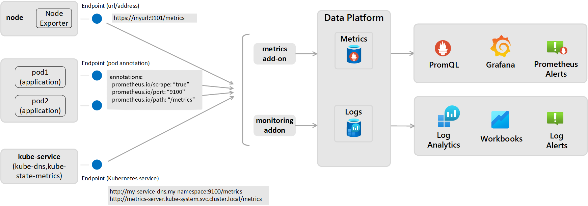

# Chrony Tracker

The **Chrony Tracker** project is an example solution for monitoring Azure Kubernetes Service clusters for clock errors and drifts using Managed Prometheus and Grafana.

The exporter script is designed to monitor and expose metrics related to the Chrony time synchronization service. These metrics can be scraped by Prometheus and visualized in tools like Grafana to ensure accurate time synchronization across your systems. The same approach could be used with other monitoring tools.



---

## Features

- **Metric Exposed**: 
  - `chrony_clock_error_ms`: Represents the clock error in milliseconds, calculated as the sum of the last offset, root dispersion, and half the root delay.
- **Docker Container**:
  - Designed to run as a DaemonSet in Kubernetes clusters.
  - Configured to integrate seamlessly with Prometheus for metric scraping.
  - Creates a non-root user for safe execution, which is added to sudoers and can only execute the Prometheus exporter script.
- **Security**:
  - Runs as a **non-root user** for enhanced security.
  - Operates in a **read-only filesystem**, ensuring minimal attack surface and compliance with best practices for containerized applications.

---

## How It Works

1. **Access to chrony on Kubernetes nodes**:
   - The DaemonSet definition file exposes the underlying host's chrony socket (`/run/chrony`) to the pod, allowing it to generate reporting using `chronyc tracking`.

2. **Exporter Script**:
   - The `chrony_exporter.py` script generates metrics from the Chrony service by parsing the output of the `chronyc tracking` command.
   - It calculates the clock error as:
     ```text
     clock_error = |last_offset| + root_dispersion + (0.5 * root_delay)
     ```
   - The result is exposed as the Prometheus metric `chrony_clock_error_ms`.
   - The `SLEEP_INTERVAL` variable in the script defines how often data should be generated and can be controlled by the environment variable in the DaemonSet definition file.

3. **Entrypoint Script**:
   - The `entrypoint.sh` script ensures the exporter runs securely as a non-root user and executes the Python script:
     ```bash
     sudo /app/venv/bin/python chrony_exporter.py
     ```

4. **Prometheus Integration**:
   - The project includes a Prometheus ConfigMap (`ama-metrics-prometheus-config-configmap.yaml`) to configure Prometheus to scrape metrics from the exporter.

---

## Pod Security Features

- **Non-Root Execution**:
  - The pod runs as a non-root user, reducing the risk of privilege escalation.
- **Read-Only Filesystem**:
  - The pod operates in a read-only filesystem, ensuring that no unauthorized writes can occur during runtime.

---

## Prerequisites

- Python 3.8 or higher
- [Azure Managed Prometheus and Grafana enabled](https://learn.microsoft.com/en-us/azure/azure-monitor/containers/kubernetes-monitoring-enable?tabs=cli) (can work with self-managed as well)
- [Prometheus client library](https://github.com/prometheus/client_python)
- Azure Kubernetes cluster 

---

## Setup Instructions

1. **Clone the repository**:
   ```bash
   git clone https://github.com/Azure/chrony-tracker
   ```

2. **Build the Docker image**:
   ```bash
   docker build --platform=linux/amd64 -t <tag> .
   ```

3. **Push the Docker container to your desired container registry**.

4. **Update the `image` value in `chrony-ds.yaml` accordingly**.

5. **Deploy the `chrony-ds.yaml` file**:
   ```bash
   kubectl apply -f chrony-ds.yaml
   ```

6. **Apply the Prometheus ConfigMap and delete the "ama-metrics-xxx" pods to apply the new configurations**:
   ```bash
   kubectl apply -f ama-metrics-prometheus-config-configmap.yaml
   ```

7. **View metrics on Azure Managed Grafana (example)**:

   

---

## Contributing

This project welcomes contributions and suggestions. Most contributions require you to agree to a Contributor License Agreement (CLA) declaring that you have the right to, and actually do, grant us the rights to use your contribution. For details, visit [https://cla.opensource.microsoft.com](https://cla.opensource.microsoft.com).

When you submit a pull request, a CLA bot will automatically determine whether you need to provide a CLA and decorate the PR appropriately (e.g., status check, comment). Simply follow the instructions provided by the bot. You will only need to do this once across all repos using our CLA.

This project has adopted the [Microsoft Open Source Code of Conduct](https://opensource.microsoft.com/codeofconduct/). For more information, see the [Code of Conduct FAQ](https://opensource.microsoft.com/codeofconduct/faq/) or contact [opencode@microsoft.com](mailto:opencode@microsoft.com) with any additional questions or comments.

---

## Trademarks

This project may contain trademarks or logos for projects, products, or services. Authorized use of Microsoft trademarks or logos is subject to and must follow [Microsoft's Trademark & Brand Guidelines](https://www.microsoft.com/en-us/legal/intellectualproperty/trademarks/usage/general). Use of Microsoft trademarks or logos in modified versions of this project must not cause confusion or imply Microsoft sponsorship. Any use of third-party trademarks or logos is subject to those third-party's policies.
